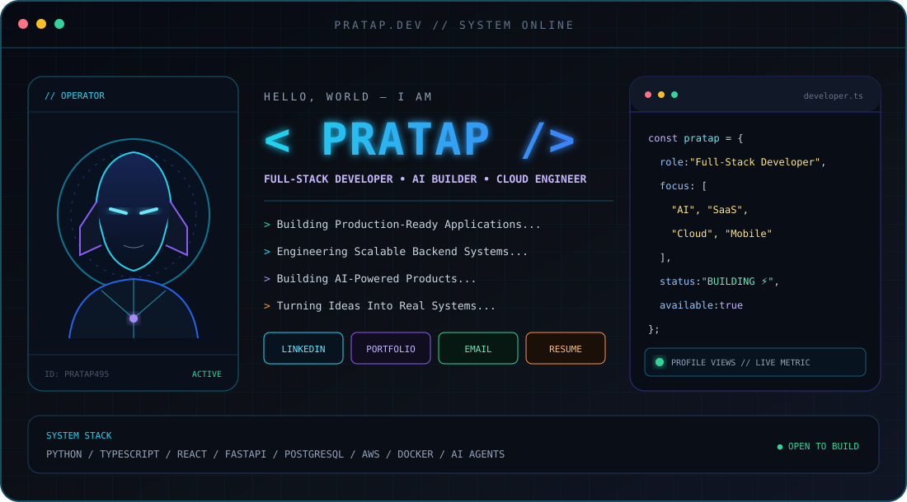

<!--
  GitHub Profile README for github.com/pratap495
  Replace every YOUR_* placeholder below before publishing contact/project links.
-->

  

  

<!-- Replace YOUR_LINKEDIN_URL, YOUR_PORTFOLIO_URL, YOUR_EMAIL, and YOUR_RESUME_URL. -->

  
  
  
  

  

 

  

 

<!-- Replace the four project URL placeholders with public repository or product URLs. -->

  

  <a href="YOUR_HOSTELMINT_URL">HOSTELMINT</a>&nbsp;&nbsp;·&nbsp;&nbsp;
  <a href="YOUR_AI_SYSTEMS_URL">AI SYSTEMS</a>&nbsp;&nbsp;·&nbsp;&nbsp;
  <a href="YOUR_ERP_POS_URL">ERP + POS</a>&nbsp;&nbsp;·&nbsp;&nbsp;
  <a href="YOUR_FAMILYMEDIAHUB_URL">FAMILYMEDIAHUB</a>

## 📊 GitHub Analytics

  
  

  

## 🏆 GitHub Trophies

  

 

  

## 🐍 Contribution Activity

  

 

  <pre>┌──────────────────────────────────────────────────────────────┐
│  "The best way to predict the future is to build it."       │
│                                                              │
│  Thanks for visiting!                                        │
│  Let's build something amazing together.                     │
└──────────────────────────────────────────────────────────────┘</pre>

  
  
  
  

  Designed and built by <a href="https://github.com/pratap495">Pratap</a> · STATUS: BUILDING THE FUTURE ⚡

