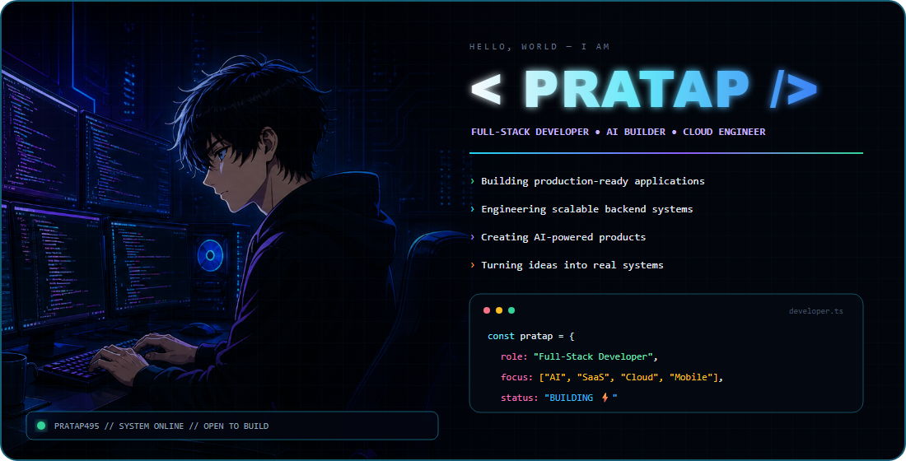
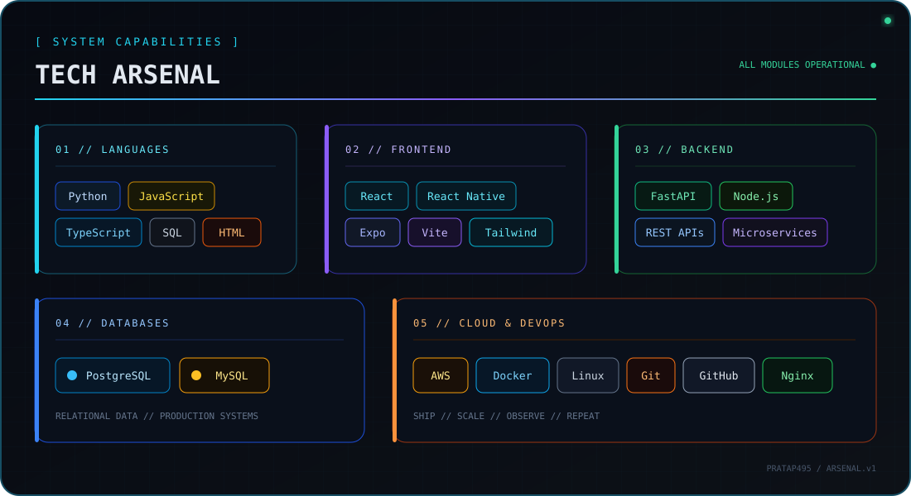
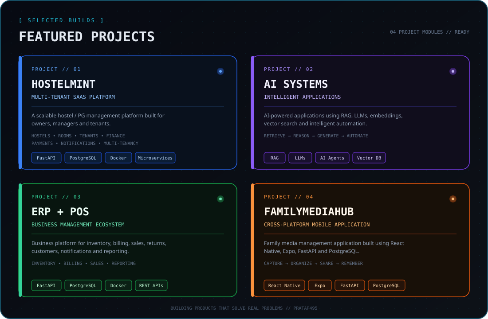
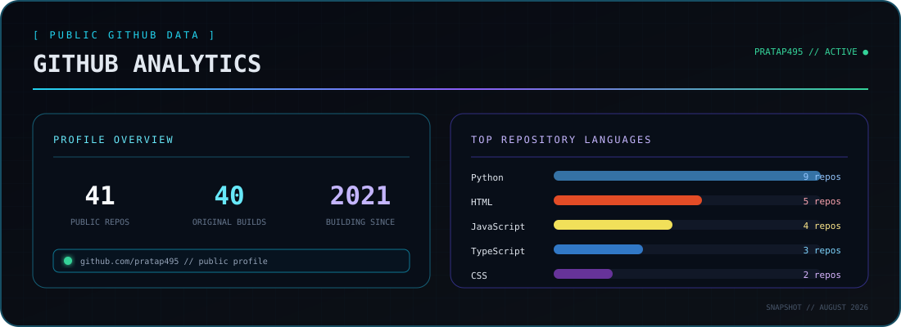
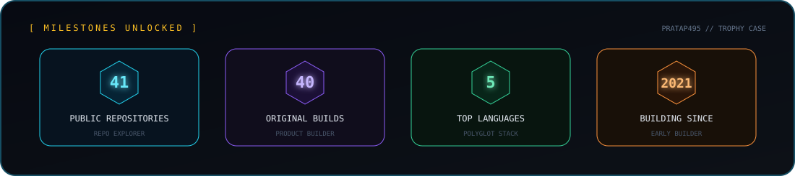
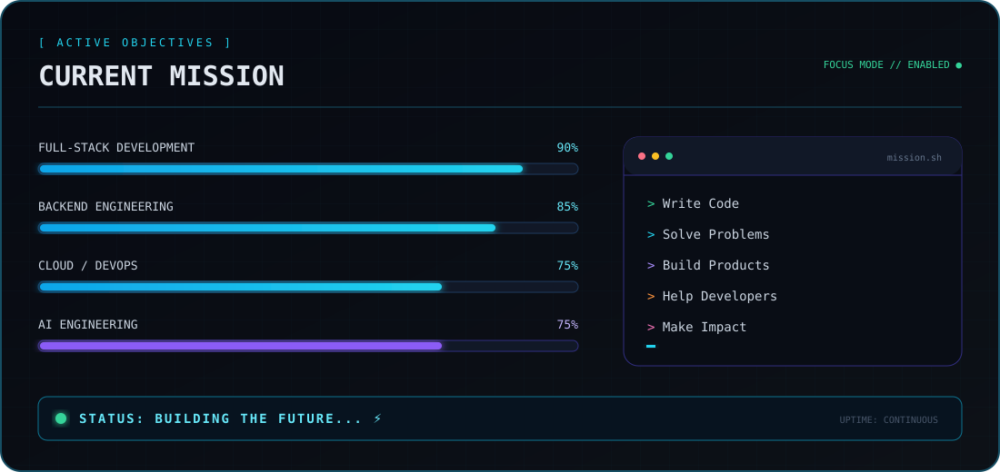

  

  

  
  
  
  

 

  

 

  

  <a href="https://github.com/pratap495/hostel-mangement">HOSTELMINT</a>&nbsp;&nbsp;·&nbsp;&nbsp;
  <a href="https://github.com/pratap495/Handora-AI">AI SYSTEMS</a>&nbsp;&nbsp;·&nbsp;&nbsp;
  <a href="https://github.com/pratap495/pos">ERP + POS</a>&nbsp;&nbsp;·&nbsp;&nbsp;
  <a href="https://github.com/pratap495?tab=repositories">ALL PROJECTS</a>

## 📊 GitHub Analytics

  

## 🏆 GitHub Trophies

  

 

  

## 🐍 Contribution Activity

  <picture>
    <source media="(prefers-color-scheme: dark)" srcset="https://raw.githubusercontent.com/pratap495/pratap495/gh-pages/github-contribution-grid-snake-dark.svg" />
    <source media="(prefers-color-scheme: light)" srcset="https://raw.githubusercontent.com/pratap495/pratap495/gh-pages/github-contribution-grid-snake.svg" />
    
  </picture>

 

> “The best way to predict the future is to build it.”

  Thanks for visiting. Let's build something amazing together. 🚀

   

  
  

   
  Designed and built by <a href="https://github.com/pratap495">Pratap</a> · STATUS: BUILDING THE FUTURE ⚡

